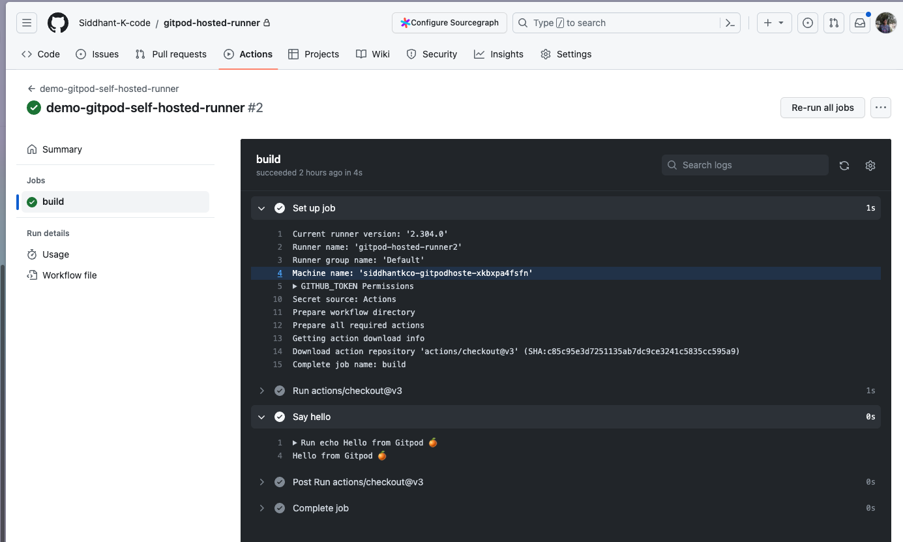

# Debugging GitHub Actions using Gitpod

Testing out the GitHub Actions is a tough task, especially when you are dealing with Self-Hosted Runners for your enterprises. With this repository, you can set up and use a self-hosted runner within [Gitpod's Cloud Development Environment (CDE)](https://www.gitpod.io/cde).

## Setup

### Step 1: Generate a GitHub Personal Access Token

To use a self-hosted runner, you need to [generate a personal access token (PAT) in GitHub](https://github.com/settings/tokens/new?description=Gitpod+and+Self+Hosted+Runner&scopes=repo,admin:org,workflow). The token must have repo scope if you're going to use the runner with a private repository, or public_repo scope if you're going to use it with a public repository. You can use a PAT to configure each self-hosted runner or you can use the same PAT for each self-hosted runner that you create.

### Step 2: Configure the GitHub Personal Access Token

Set the GitHub Personal Access Token as `RUNNER_TOKEN` in [Gitpod Environment Variables](https://gitpod.io/user/variables) with scope to your repository `{REPO_OWNER_NAME}/{REPO_NAME}` for that certain repository (Recommended) OR `*/*` for all Repositories you will open in Gitpod Workspace.

[](https://gitpod.io/user/variables)

## Step 3: Start the Gitpod Workspace

It would open a fresh, ephemeral CDE with GitHub CLI Installed & ready-to-use.

[](https://gitpod.io/#https://github.com/Siddhant-K-code/gitpod-hosted-runner/)

## Usage

### Step 1: Create a Self-Hosted Runner

You can easily create a self-hosted runner using the [GitHub CLI](https://cli.github.com/). For example, the following command creates a self-hosted runner in the current repository. You can pass any preferred name for your runner.

```bash
source create-runner.sh siddhant-demo-runner-01
```

### Step 2: Use & Run GitHub Action Workflow Self-Hosted Runner

Once the self-hosted runner is set up and running, you can utilize it in your GitHub Actions workflows.

- Open your GitHub repository.
- Navigate to the Actions tab.
- Create or modify a workflow file (e.g., [.github/workflows/demo.yml](.github/workflows/demo.yml)).
  Specify the runner label in your workflow file to target the self-hosted runner. For example:

  ```yml
  jobs:
  build:
    runs-on: self-hosted
  ```

- Commit and push your workflow file to trigger the workflow using the self-hosted runner.

    
---

> Here, `Machine name` will be your Gitpod Workspace URL.

### 🗒️ Note

#### ♻️ Reuse in Existing Gitpod Workspace

If you've got an existing Gitpod workspace that you want to turn into a runner:

- Set the GitHub PAT Token above as Gitpod environment variables.
- Run [create-runner.sh](./create-runner.sh) in the terminal with above instructions.
